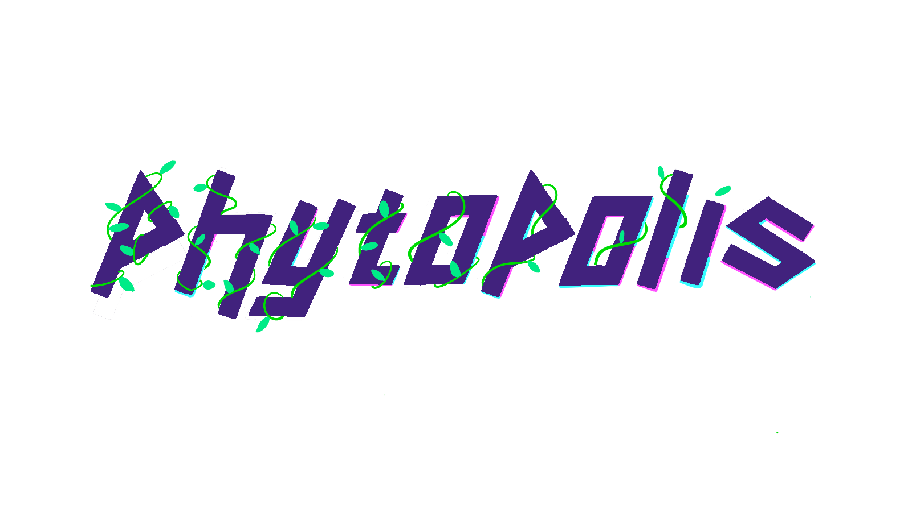

# Phytopolis
Ascend and defend a flourishing plant against the dangers of a careless society until it reaches a clear sky beyond the rooftops of a polluted metropolis, leaving behind a lush legacy of green.

## Concept statement
Step into the world of Phytopolis, where nature clashes with technology in a mesmerizing showdown. Your mission? Take a humble sprout and cultivate it into a thriving vine as it climbs up the concrete chaos of a cyberpunk metropolis. Sunlight absorbed by leaves will keep the plant alive as you use water to branch upwards. Extinguish fiery flames, stomp on invasive cyberbugs, and protect your plant until it reaches the clear skies above. 

## Download
Download the [latest release](https://github.coecis.cornell.edu/pp457/phytopolis/releases) according to your OS (we provide Windows and macOS releases), unzip the files, and run the game. Note that the macOS release is not signed, so you may need to [follow these instructions](https://support.apple.com/guide/mac-help/open-a-mac-app-from-an-unidentified-developer-mh40616/mac) to run it.

## Getting started

- **Movement:** Use `A` and `D` to move horizontally, `W` to jump, and `S` to fall through leaves.
- **Growing:** Click over branch previews to build branches, hold left shift and click over leaf previews to build or upgrade leaves.
- **Resource management:** Growing and upgrading branches and leaves requires water, collected by colliding with water drops.
- **Sunlight:** Collect sunlight falling from the sky by positioning leaves to add time to the timer.
- **Challenges:** Extinguish fire by clicking on it, consuming some water, and stomp on bugs to eliminate them.
- **Navigation:** Scroll through levels with mouse scroll, snap camera back to the player by pressing any movement key.
- **Customization:** Adjust controls, graphics, and sound options in the menus.

## Roadmap

- We are currently preparing a Steam release after a few minor fixes are completed.

## Authorship

Phytopolis is developed by Syndic8, a team composed of the following members:
- Jordan Rudolph, team lead, programmer, and composer
- Pedro Pontes García, programming lead, programmer and UX assistant
- Alanna Cooney, design lead, artist and UX designer
- Ireanne Cao, programmer
- Kevin Chang, UX designer and art assistant
- Amy Mai, programmer
- Shirley Li, artist and UX assistant
- Tawakalt Bisola Okunola, programmer

We reserve all rights to the source code of Phytopolis, although we grant Cornell University a permanent, non-exclusive license for the game as it is submitted at Showcase on May 18, 2024. Cornell University has the right to archive, exhibit, and distribute that version of the game for promotional and non-commercial purposes.

**© Syndic8, 2024**
