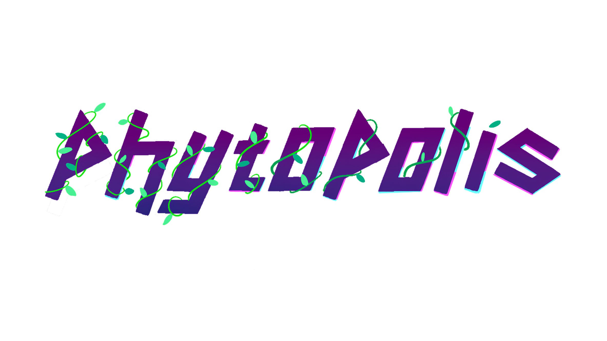

# Phytopolis

Sow seeds of hope in a city of shadows by cultivating and climbing a sprout as it grows into a mighty ivy! Ascend and defend a flourishing plant against the dangers of a careless society until it reaches a clear sky beyond the rooftops of a polluted metropolis, leaving behind a lush legacy of green.

## Getting Started

- **Movement:** Use `A` and `D` to move horizontally, `W` to jump, and `S` to fall through leaves.
- **Growing:** Click over branch previews to build branches, hold left shift and click over leaf previews to build or upgrade leaves.
- **Resource management:** Growing and upgrading branches and leaves requires water, collected by colliding with water drops.
- **Sunlight:** Collect sunlight falling from the sky by positioning leaves to add time to the timer.
- **Challenges:** Extinguish fire by clicking on it, consuming some water, and stomp on bugs to eliminate them.
- **Navigation:** Scroll through levels with mouse scroll, snap camera back to the player by pressing any movement key.
- **Customization:** Adjust controls, graphics, and sound options in the menus.

## Roadmap

- **Level design:** Finalize remaining levels to complete the game's progression.
- **Sound effects:** Include more audio effects to enhance gameplay experience.
- **Visual improvements:** Introduce a more varied tile set and enhance visual feedback for player and environment interactions.
- **Tutorial:** Implement tutorial cues in the initial levels to guide players.
- **Additional features:** Incorporate bug nests and decay zones for added complexity and challenge.

## Authorship

Phytopolis is developed by Syndic8, a team composed of the following members:
- Jordan Rudolph, team lead and programmer
- Pedro Pontes García, programming lead and programmer
- Alanna Cooney, design lead, artist and UX designer
- Ireanne Cao, programmer
- Kevin Chang, UX designer and art assistant
- Amy Mai, programmer
- Shirley Li, artist and UX assistant
- Tawakalt Bisola Okunola, programmer

We reserve all rights to the source code of Phytopolis, although we grant Cornell University a permanent, non-exclusive license for the game as it is submitted at Showcase on May 18, 2024. Cornell University has the right to archive, exhibit, and distribute that version of the game for promotional and non-commercial purposes.

**© Syndic8, 2024**
